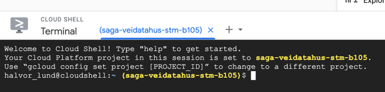
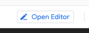
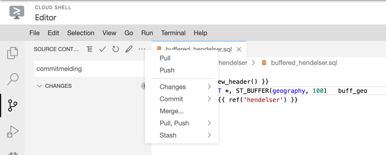

# dbt-public

Dette repoet inneholder nyttig kode og dokumentasjon for å jobbe med dbt på Saga og med Github actions.

# Kom igang med dbt-utvikling

Den enkleste måten å sette opp et utviklingsmiljø for dbt på, er med Google Cloud Shell.
Google Cloud Shell finner du [her](https://console.cloud.google.com/home/dashboard?cloudshell=true).
Dette vil åpne et terminalvindu nederst på siden.



## Førstegangsoppsett

For å sette opp miljøet første gang, må du gjøre følgende kommandoer:

### Installere github-klient (gh)

Dette installerer en github-klient og logger deg inn på github.

```bash
curl -fsSL https://cli.github.com/packages/githubcli-archive-keyring.gpg | sudo dd of=/usr/share/keyrings/githubcli-archive-keyring.gpg
echo "deb [arch=$(dpkg --print-architecture) signed-by=/usr/share/keyrings/githubcli-archive-keyring.gpg] https://cli.github.com/packages stable main" | sudo tee /etc/apt/sources.list.d/github-cli.list > /dev/null
sudo apt update
sudo apt install gh
gh auth login
```

Velg alle standard-alternativene som `gh auth login` foreslår (Github.com, HTTPS, Login with web browser).

### Konfigurere git

Sett opp git til å bruke ditt navn og e-postadresse.

```bash
git config --global user.email you@example.com
git config --global user.name YourName
```

### Klone repo

Nå kan du klone ditt Github-repo:

```bash
git clone <repo-URL>
```

## Utvikling

I Cloud Shell kan du trykke Open Editor for å åpne en IDE for å utvikle.



Velg `File -> Open workspace` for å åpne repoet ditt som et workspace.

- Lag en ny branch/gren ved å `Ctrl/Cmd + Shift + P`, velg `Git checkout` og skriv deretter navnet på grenen, f.eks. `add-tunnel-view`.
- Gjør de endringene du ønsker å gjøre, sjekk deretter inn i `Source control`-taben.
- Gjør `Git push` for å pushe til Github.



## Kjøre dbt

Det er ikke nødvendig å kunne kjøre `dbt` for å kunne utvikle nye dbt-modeller.
Hvis du derimot ønsker å teste nye modeller lokalt, kan du installere `dbt` i ditt Cloud Shell.

Først må du oppgradere setuptools, og deretter installere `dbt-bigquery`:

```bash
pip3 install --upgrade setuptools
pip3 install dbt-bigquery
```

Se [dbt-readme](dbt/README.md) for mer informasjon.

For å sette opp et skall til et `dbt`-prosjekt, kjør `dbt init` i din prosjektmappe.

# Nyttig kode i dbt-public

Vi kan dele koden i to typer:

## dbt-makroer

`dbt`-mappen inneholder makroer for dbt for å gjøre enkelte operasjoner enklere.

Se [dbt-readme](dbt/README.md) for dokumentasjon om disse.

## Workflows for Github actions

Disse workflowene kan brukes til å teste og deploye dbt-kode.
To av disse krever at repoet ditt har en `projects.config.json`, på denne formen:

```yaml
{
  "project_numbers":
    {
      "PROD": "<prod project number>",
      "STM": "<stm project number>",
      "ATM": "<atm project number>",
    },
  "PROD": "<prod project name>",
  "STM": "<stm project name>",
  "ATM": "<atm project name>",
}
```

### dbt-deploy: Deploy dbt til GCP-prosjekt

`dbt-deploy` gjør følgende:

1. Kjører enhetstester (tester taget med `unit-test`)
2. Kjører `dbt seed`
3. Kjører `dbt run`
4. Kjører `dbt test`
5. Genererer og laster opp dbt-dokumentasjon til en GCS-bøtte

Brukes slik:

```yaml
jobs:
  deploy_stm:
    name: Deploy dbt to STM
    uses: svvsaga/dbt-public/.github/workflows/dbt-deploy.yml@<version>
    with:
      dbt_path: <folder with your dbt project>
      dbt_args: --profile <profile name> --target <target>
      dbt_project_name: <your dbt project name>
      docs_bucket: <name of GCS bucket>
      projects_config_path: <path to folder with projects.config.json>
      service_account: <name of service account to use, default is project-service-account>
      environment: STM
```

Antar at du har en `profiles.yml`-fil i dbt-prosjektmappen som inneholder profiler på denne formen:

```yaml
<profile name>:
  outputs:
    <target>:
      type: bigquery
      method: oauth
      project: <GCP project ID>
      ...
```

der `<target>` typisk er `STM`, `ATM` eller `PROD`.

### dbt-pr: Tester dbt-kode og poster dokumentasjon på PR

`dbt-pr` gjør følgende:

1. Kjører enhetstester (tester taget med `unit-test`)
2. Oppretter midlertidige datasett i STM-prosjektet
3. Kjører `dbt seed` og `dbt run` i midlertidige datasett
4. Genererer og laster opp docs til GCS-bøtte
5. Sammenligner skjema med skjema i ATM og poster som kommentar på PR

Siden denne kjører `dbt run`, bør man være oppmerksom på kostnad dersom det lages veldig mange tabeller med mange bytes.
Man kan unngå at disse lages som tabeller dersom man bruker makroen `table_or_view`, se [dbt-readme](dbt/README.md).

Brukes slik:

```yaml
jobs:
  dbt-run-test:
    uses: svvsaga/dbt-public/.github/workflows/dbt-pr.yml@<version>
    with:
      dbt_path: <folder with your dbt project>
      dbt_args: --profile <profile name> --target <pr target name>
      dbt_project_name: <dbt project name>
      stm_project_id: <stm project ID>
      stm_docs_bucket: <stm docs bucket>
      atm_docs_bucket: <atm docs bucket>
      projects_config_path: <path to folder with projects.config.json>
      service_account: <name of service account to use, default is project-service-account>
```

Antar at du har en `profiles.yml`-fil i dbt-prosjektmappen som inneholder profiler på denne formen:

```yaml
<profile name>:
  outputs:
    <pr target name>:
      type: bigquery
      method: oauth
      project: <stm project ID>
      dataset: "{{ env_var('DBT_DATASET') }}"
```

### dbt-sqlfluff-lint

Denne workflowen brukes i PR-er for å sjekke formattering av SQL-filer med sqlfluff.
Den gjør følgende:

1. Bestemmer hvilke filer som er endret i PR-en
2. Kjører `sqlfluff lint` på endrede SQL-filer i dbt-mappen
3. Poster kommentarer på PR dersom formattering ikke følger sqlfluffs regler

Denne antar at man har en `.sqlfluff`-konfigurasjon i dbt-mappen.

Brukes slik:

```yaml
jobs:
  check-sql-formatting:
    uses: svvsaga/dbt-public/.github/workflows/dbt-sqlfluff-lint.yml@<version>
    with:
      dbt_path: <folder with dbt project>
```

## Utvikling av dbt-public

For å lage nye versjoner, skriv #patch, #minor eller #major i commit-meldingen.
